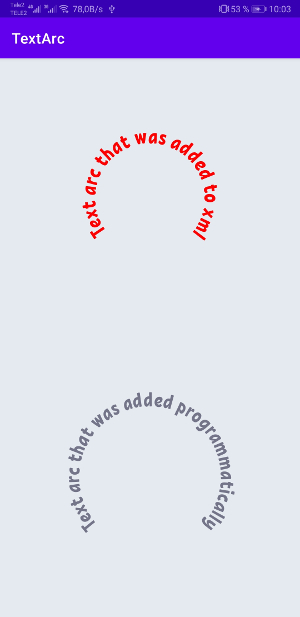

# Android TextArc

Creating a simple arc text

# Preview



# How to use

In xml

```
<com.a_lab.textarc.TextArc
            android:layout_width="wrap_content"
            android:layout_height="wrap_content"
            android:layout_gravity="center"
            app:text="Text arc that was added to xml"
            app:radius="75dp"
            app:center_angle="-90"
            app:text_size="28sp"
            app:text_color="@color/red"
            app:font_family="@font/krabuler"/>
```

In code
java
```
TextArc textArc = new TextArc(this);
        textArc.setText("Text arc that was added programmatically");
        textArc.setRadius(255);
        textArc.setCenterAngle(-90);
        textArc.setTextColor(R.color.blue);
        textArc.setTextSize(72);
        textArc.setFontFamily(ResourcesCompat.getFont(this, R.font.krabuler));
```
Kotlin
```
TextArc(this).apply {
	setText("Text arc that was added programmatically")
	setRadius((resources.displayMetrics.density * 95).toInt())
        setCenterAngle(-90)
        setTextColor(R.color.blue)
        setTextSize((resources.displayMetrics.density * 28).toInt())
        setFontFamily(ResourcesCompat.getFont(this@MainActivity, R.font.krabuler))
}
```
# To get a Git project into your build:
Add it in your root build.gradle at the end of repositories
```
allprojects {
	repositories {
		...
		maven { url 'https://jitpack.io' }
	}
}
```
```
dependencies {
	implementation 'com.github.AndroidLab:textarc:Tag'
}
```
